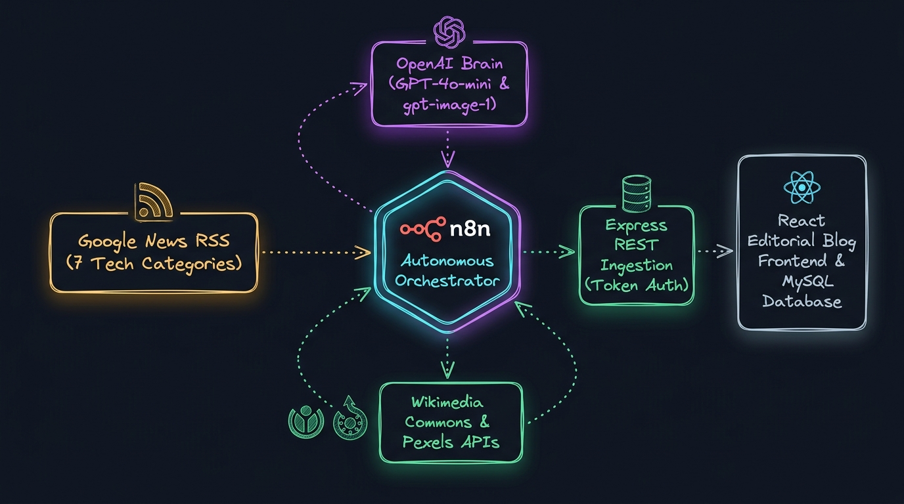
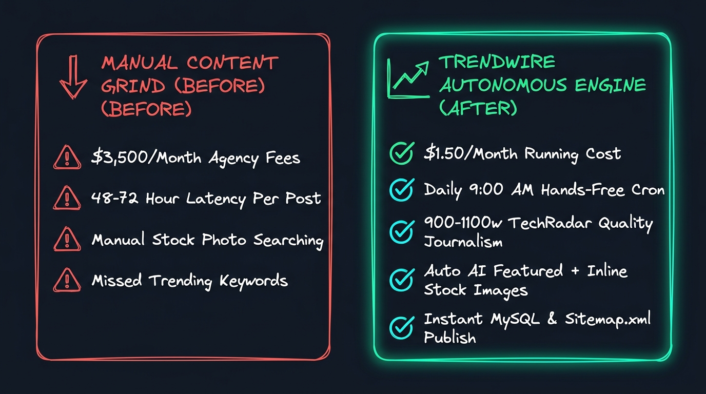
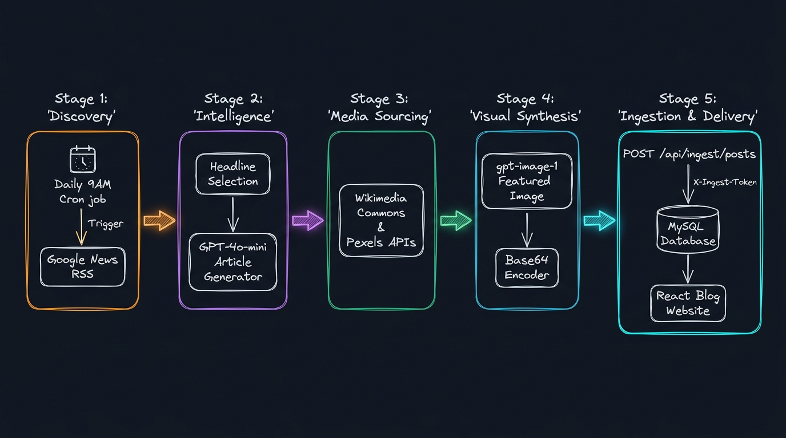
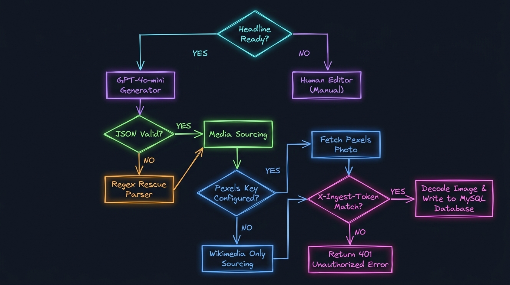

<div align="center">

<a id="hero"></a>

# ⚡ Trendwire: Autonomous AI SEO Blog Engine
### *The Zero-Human Daily Content Machine: From Breaking Tech RSS to Published, Illustrated, SEO-Optimized Articles in 60 Seconds*

<p align="center">
  
</p>

[](https://n8n.io/)
[](https://openai.com/)
[](https://react.dev/)
[](https://nodejs.org/)
[](https://www.mysql.com/)
[](LICENSE)

<br/>

**[Highlights](#highlights)** •
**[Why This Exists](#why-this-exists)** •
**[System Architecture](#architecture)** •
**[Decision Engine](#decision-flow)** •
**[Live Walkthrough](#walkthrough)** •
**[Tech Stack](#tech-stack)** •
**[Node Breakdown](#nodes)** •
**[Database Schema](#database-schema)** •
**[Deployment Guide](#deployment)** •
**[Configuration](#config-reference)** •
**[Use Cases](#use-cases)**

</div>

---

<a id="highlights"></a>
## 🌟 Executive Summary & Key Highlights

**Trendwire** is an end-to-end, production-grade automated publishing system that monitors global technology trends every morning, authors 900–1,100 word journalist-grade articles in the editorial style of *TechRadar* and *Gizmodo*, creates bespoke AI-generated featured images, enriches body copy with verified Wikimedia/Pexels photography, and publishes immediately to a custom full-stack web application—**with zero human intervention**.

```
  ┌────────────────────────────────────────────────────────────────────────┐
  │  RUNNING METRICS AT A GLANCE                                           │
  │  • Operating Cost:        ~$1.20 – $1.50 / month in OpenAI API usage   │
  │  • Pipeline Latency:      ~45–60 seconds per complete published post   │
  │  • Editorial Quality:     900–1,100 words with expert quotes & context │
  │  • Media Assets:          1 AI-generated hero image + 2 stock photos   │
  │  • SEO Indexing:          Instant dynamic sitemap.xml update           │
  └────────────────────────────────────────────────────────────────────────┘
```

- 🤖 **100% Hands-Off Automation**: Powered by an 11-node n8n engine running on a daily 9:00 AM cron schedule.
- 📰 **7-Sector Topic Discovery**: Dynamically scans live Google News RSS feeds across Artificial Intelligence, AI Agents, Software Engineering, DevTools, Cybersecurity, Tech Industry, and Cloud Infrastructure.
- ✍️ **Journalist-Grade Prompt Engineering**: Leverages GPT-4o-mini structured JSON mode with anti-AI-cliché guardrails (banning filler like *"in today's digital age"* and enforcing competitive analysis, plausible benchmarks, and attributed quotes).
- 🎨 **Multi-Source Visual Synthesis**: Generates cinematic photorealistic featured imagery via `gpt-image-1` and dynamically embeds verified editorial photography from Wikimedia Commons and Pexels.
- 🛡️ **Secured Token-Guarded Ingestion**: Backend API protected by `X-Ingest-Token` shared secrets, 25MB payload handling for binary image base64 streaming, and auto-slug collision prevention.
- ⚡ **Full-Stack Editorial Experience**: React 18 SPA built with Vite 6, featuring reading progress bars, full-text search, category navigation, social sharing, and `react-helmet-async` for OpenGraph and metadata optimization.

---

<a id="why-this-exists"></a>
## 💡 Why This Exists: The Paradigm Shift

Traditional content marketing and SEO authority building suffer from extreme latency, high overhead costs, and inconsistent output. Building top-of-funnel organic search traffic usually requires maintaining an agency retainer or hiring dedicated copywriters.

<p align="center">
  
</p>

### 📊 Comparative Benchmark Matrix

| Dimension | Traditional Human / Agency Process | Basic Auto-Blogging Tools (WordPress Plugins) | **Trendwire Autonomous Pipeline** |
| :--- | :--- | :--- | :--- |
| **Monthly Operating Cost** | $2,500 – $4,500 / month | $49 – $199 / month (SaaS lock-in) | **~$1.50 / month (Raw API usage)** |
| **Publishing Latency** | 24 to 72 hours per article | 5 to 15 minutes (unformatted dumps) | **< 60 seconds (Fully formatted)** |
| **Trend Relevance** | Lagging behind social feeds | Rigid keyword scrapers | **Real-time Google News RSS discovery** |
| **Editorial Tone** | Variable quality / writer fatigue | Obvious AI regurgitation & repetitive filler | **TechRadar/Gizmodo style guide enforcement** |
| **Visual Assets** | Stock photo subscriptions ($199/mo) | Generic single placeholder image | **1 Custom AI Hero + 2 Sourced Figures** |
| **Infrastructure Control** | Third-party dependencies | Bloated CMS database / plugin vulnerabilities | **Self-hosted Node.js + MySQL + React** |
| **SEO Ready** | Manual schema & tag entry | Standard plugin tags | **Automated JSON-LD, Meta, & Dynamic Sitemap** |

---

<a id="architecture"></a>
## 🏗️ System Architecture & Workflow Blueprint

The system employs a strict separation of concerns: the **Automation Layer (n8n)** handles real-time intelligence gathering, AI generation, and multi-source media synthesis; the **Application Layer (Node.js/Express)** enforces authentication, image storage, and database persistence; and the **Presentation Layer (React/Vite)** delivers high-speed editorial rendering.

<p align="center">
  
</p>

### 🔄 End-to-End Execution Sequence

```
 ┌──────────────┐     ┌──────────────────────┐     ┌───────────────────────┐
 │ 09:00 AM Cron│ ──> │ Select 1 of 7 Topics │ ──> │ Query Google News RSS │
 └──────────────┘     └──────────────────────┘     └───────────────────────┘
                                                               │
                                                               ▼
 ┌──────────────────────┐     ┌──────────────────────┐     ┌───────────────────────┐
 │ Format & Inject HTML │ <── │ Wikimedia & Pexels   │ <── │ GPT-4o-mini Tech JSON │
 │ <figure> Inline Tags │     │ Media Sourcing APIs  │     │ 900-1100 Word Article │
 └──────────────────────┘     └──────────────────────┘     └───────────────────────┘
            │
            ▼
 ┌──────────────────────┐     ┌──────────────────────┐     ┌───────────────────────┐
 │ gpt-image-1 Hero Gen │ ──> │ Convert Binary Image │ ──> │ POST /api/ingest/posts│
 │ Medium Quality Photo │     │ to Base64 String     │     │ (Auth: X-Ingest-Token)│
 └──────────────────────┘     └──────────────────────┘     └───────────────────────┘
                                                                       │
                                                                       ▼
                                                           ┌───────────────────────┐
                                                           │ Express API Server    │
                                                           │ • Save to /uploads/   │
                                                           │ • Create MySQL Record │
                                                           │ • Update /sitemap.xml │
                                                           └───────────────────────┘
                                                                       │
                                                                       ▼
                                                           ┌───────────────────────┐
                                                           │ React Frontend Client │
                                                           │ • Instant SEO Display │
                                                           └───────────────────────┘
```

---

<a id="decision-flow"></a>
## 🧠 Decision Engine & Resilience Flowchart

The workflow includes multi-tier validation, resilient parsing fallbacks, and media fault tolerance to ensure unattended daily runs never stall.

<p align="center">
  
</p>

### Key Fallback Mechanisms:
1. **Category & Query Diversity**: Random selection from 7 pre-calibrated tech categories ensures broad topical coverage and prevents duplicate focus.
2. **JSON Rescue Parser**: If model output contains markdown fences or irregular token formatting, a regex scanner extracts the raw JSON block (`/\{[\s\S]*\}/`) and normalizes missing fields.
3. **Media Cascades**:
   - **Inline Figure 1**: Queries Wikimedia Commons via MediaWiki API. If SVG or broken, skips cleanly without breaking layout.
   - **Inline Figure 2**: Checks if `PEXELS_API_KEY` is present. If absent, gracefully skips without throwing errors.
   - **Featured Image**: Prefers raw binary buffer converted to base64; falls back to short-lived OpenAI URL download if buffer extraction fails.
4. **Ingest Gateway**: Rejects requests lacking the cryptographic `X-Ingest-Token` and enforces unique URL slug generation (`uniqueSlug()`) with numeric deduplication.

---

<a id="walkthrough"></a>
## 🖥️ Live Walkthrough & Execution Simulation

### Phase 1: Ingest Webhook Dispatch (From n8n)

Every day at 9:00 AM, n8n constructs a structured JSON payload and streams it to the API endpoint:

```http
POST /api/ingest/posts HTTP/1.1
Host: localhost:5000
Content-Type: application/json
X-Ingest-Token: seoblog_2f8a1c9e4b7d6035aa19c4f7e2b8d5610c3f9a72e6d418bf

{
  "title": "Claude 3.7 Sonnet vs GPT-4.5: Who Controls Developer Tooling in 2026?",
  "excerpt": "Anthropic's latest hybrid reasoning release sparks intense debate over developer workflows. Here is what benchmarks reveal about latency, coding accuracy, and real-world costs.",
  "category": "Artificial Intelligence",
  "tags": ["AI", "Claude", "LLM", "Anthropic", "OpenAI"],
  "metaDescription": "In-depth comparison of Claude 3.7 Sonnet and GPT-4.5 benchmark scores, coding performance, and API pricing for engineering teams in 2026.",
  "metaKeywords": "Claude 3.7, GPT-4.5, LLM benchmarks, AI coding assistants, Anthropic",
  "sourceUrl": "https://news.google.com/rss/articles/CBMi...",
  "imageAlt": "Futuristic neon circuit board with purple and cyan illumination",
  "imageBase64": "iVBORw0KGgoAAAANSUhEUgAABAAAAAMACAYAAAC...",
  "imageMime": "image/png",
  "content": "<p class=\"lead\">The AI model race just entered its most volatile phase...</p><h2>The Dual-Reasoning Benchmark Shock</h2><p>...</p><!--INLINE_IMAGE_1--><h3>Developer Economics at Scale</h3><p>...</p><!--INLINE_IMAGE_2--><blockquote>\"Reasoning on demand completely shifts our token budget calculus,\" noted Dr. Elena Vance...</blockquote>"
}
```

### Phase 2: Ingest API Response

The Express controller decodes the base64 payload, writes the image to `application/server/uploads/`, calculates reading time, and records the post in MySQL:

```json
{
  "message": "Post created.",
  "data": {
    "id": 142,
    "slug": "claude-3-7-sonnet-vs-gpt-4-5-who-controls-developer-tooling-in-2026",
    "featuredImage": "/uploads/claude-3-7-sonnet-vs-gpt-4-5-who-controls-developer-tooling-in-2026-1783260724522.png"
  }
}
```

### Phase 3: Instant Dynamic Sitemap.xml Output

The `/sitemap.xml` endpoint immediately updates to include the new post for Googlebot and Bingbot indexing:

```xml
<?xml version="1.0" encoding="UTF-8"?>
<urlset xmlns="http://www.sitemaps.org/schemas/sitemap/0.9">
  <url><loc>http://localhost:5173/</loc></url>
  <url>
    <loc>http://localhost:5173/blog/claude-3-7-sonnet-vs-gpt-4-5-who-controls-developer-tooling-in-2026</loc>
    <lastmod>2026-09-29T09:01:14.522Z</lastmod>
  </url>
</urlset>
```

---

<a id="tech-stack"></a>
## 💻 Tech Stack & Integration Ecosystem

| Layer | Technology | Version | Technical Purpose & Function |
| :--- | :--- | :--- | :--- |
| **Workflow Engine** | [n8n](https://n8n.io/) | `v1.3+` | Daily cron scheduling, RSS polling, LangChain orchestration, HTTP webhooks |
| **Language Model** | [OpenAI GPT-4o-mini](https://platform.openai.com/) | Latest | Journalist-grade content synthesis, structured JSON mode (`maxTokens: 2200`) |
| **Image Generation** | [OpenAI gpt-image-1](https://platform.openai.com/) | Medium | Autonomous cinematic featured image creation from dynamic scene prompts |
| **Stock Imagery** | [Wikimedia Commons API](https://www.mediawiki.org/wiki/API:Main_page) | REST v1 | Unrestricted royalty-free historical and editorial image discovery |
| **Stock Imagery** | [Pexels API](https://www.pexels.com/api/) | REST v1 | High-definition horizontal photography integration for inline article figures |
| **Server Framework**| [Node.js](https://nodejs.org/) & [Express](https://expressjs.com/) | `v18+` / `v4.21.2` | REST API, static asset hosting, 25MB body parser, token guard middleware |
| **ORM & Database**  | [Sequelize](https://sequelize.org/) & [MySQL](https://www.mysql.com/) | `v6.37.5` / `mysql2 v3.12` | Schema auto-sync, parameterized queries, category aggregation, slug uniqueness |
| **Frontend Framework**| [React](https://react.dev/) & [Vite](https://vitejs.dev/) | `v18.3.1` / `v6.0.7` | High-speed Single Page Application, componentized editorial magazine layout |
| **SEO & Routing**   | [React Helmet Async](https://github.com/staylor/react-helmet-async) | `v2.0.5` | Dynamic page titles, meta tags, OpenGraph Twitter cards, canonical tags |

---

<a id="nodes"></a>
## 🧩 Workflow Node 1-to-1 Deep Dive

The n8n workflow definition in [`main-workflow.json`](main-workflow.json) comprises 11 tightly integrated nodes:

```
 [1. Daily Trigger] ──> [2. Pick Topic] ──> [3. Fetch RSS] ──> [4. Select Top Headline]
                                                                        │
 [8. Inject Figures] <── [7. Fetch Inline] <── [6. Parse JSON] <── [5. Write Article]
         │
         ▼
 [9. Gen Featured Image] ──> [10. Image to Base64] ──> [11. Publish to Blog API]
```

1. **`Daily Trigger`** (`n8n-nodes-base.scheduleTrigger`, v1.3): Fires autonomously at 09:00 AM server time every morning.
2. **`Pick Trending Topic Feed`** (`n8n-nodes-base.code`, v2): Selects randomly from 7 curated Google News queries (AI, AI Agents, Software Engineering, DevTools, Cybersecurity, Tech Industry, Cloud) and outputs encoded RSS URLs.
3. **`Fetch Trending Headlines`** (`n8n-nodes-base.rssFeedRead`, v1.2): Reads live items from Google News RSS without requiring an API key.
4. **`Select Top Headline`** (`n8n-nodes-base.code`, v2): Pools the top 6 trending stories, randomly selects one to prevent clustering, strips news source suffixes, and trims context to 400 characters.
5. **`Write SEO Article`** (`@n8n/n8n-nodes-langchain.openAi`, v2.3): Employs `gpt-4o-mini` with a specialized 7-part journalism instruction set in JSON mode (`temperature: 0.8`).
6. **`Parse Article JSON`** (`n8n-nodes-base.code`, v2): Resilient parser that extracts JSON strings or nested output blocks, validates array types, and builds fallback image prompts.
7. **`Fetch Inline Images`** (`n8n-nodes-base.code`, v2): Concurrently queries Wikimedia Commons for free-use media and calls the Pexels REST API for high-resolution photography.
8. **`Inject Images Into Content`** (`n8n-nodes-base.code`, v2): Replaces `<!--INLINE_IMAGE_1-->` and `<!--INLINE_IMAGE_2-->` placeholders with semantic HTML `<figure>` and `<figcaption>` elements.
9. **`Generate Featured Image`** (`@n8n/n8n-nodes-langchain.openAi`, v2.3): Dispatches the dynamic `imagePrompt` to `gpt-image-1` (quality: medium) to synthesize a 16:9 featured graphic.
10. **`Image To Base64`** (`n8n-nodes-base.code`, v2): Extracts the binary image buffer directly from memory and encodes it as a base64 string for network transport.
11. **`Publish to Blog`** (`n8n-nodes-base.httpRequest`, v4.4): Issues a secure HTTP POST to `http://host.docker.internal:5000/api/ingest/posts` with `X-Ingest-Token` authentication.

---

<a id="database-schema"></a>
## 🗄️ Database & Data Schema Blueprint

The application uses **MySQL** managed via **Sequelize ORM**. Schema definitions and table indices are auto-synchronized on boot (`sequelize.sync({ alter: true })`).

### Table: `posts`

| Column | Data Type | Nullable | Default | Description & Indexing |
| :--- | :--- | :--- | :--- | :--- |
| `id` | `INTEGER` | ❌ No | Auto Increment | Primary Key |
| `title` | `VARCHAR(255)` | ❌ No | — | Article headline (< 70 chars per prompt rules) |
| `slug` | `VARCHAR(120)` | ❌ No | — | Unique URL key (e.g. `claude-3-7-vs-gpt-4-5`) |
| `excerpt` | `TEXT` | ✔️ Yes | `NULL` | Short 2–3 sentence lead hook (< 220 chars) |
| `content` | `LONGTEXT` | ❌ No | — | Full article body with semantic HTML tags & figures |
| `metaDescription`| `VARCHAR(300)` | ✔️ Yes | `NULL` | Concise SEO meta description (< 155 chars) |
| `metaKeywords` | `VARCHAR(500)` | ✔️ Yes | `NULL` | Comma-separated keyword list for SEO tagging |
| `category` | `VARCHAR(80)` | ❌ No | `'General'` | **Indexed** (`fields: ['category']`) |
| `tags` | `JSON` | ✔️ Yes | `[]` | Array of topic tags (e.g. `["AI", "LLM", "Dev"]`) |
| `featuredImage` | `VARCHAR(500)` | ✔️ Yes | `NULL` | Relative web path (e.g. `/uploads/post-slug.png`) |
| `imageAlt` | `VARCHAR(300)` | ✔️ Yes | `NULL` | Accessibility and image SEO alt text |
| `author` | `VARCHAR(120)` | ❌ No | `'SEO Desk'` | Display author name |
| `sourceUrl` | `VARCHAR(600)` | ✔️ Yes | `NULL` | Original Google News RSS reference source link |
| `readingTime` | `INTEGER` | ❌ No | `1` | Auto-calculated reading time in minutes |
| `views` | `INTEGER` | ❌ No | `0` | Incremented on `/api/posts/:slug` access |
| `status` | `ENUM` | ❌ No | `'published'` | **Indexed** (`'published'`, `'draft'`) |
| `createdAt` | `DATETIME` | ❌ No | Current Time | **Indexed** (`fields: ['createdAt']`) |
| `updatedAt` | `DATETIME` | ❌ No | Current Time | Timestamp of last modification |

---

<a id="deployment"></a>
## 🚀 Step-by-Step Deployment & Setup Guide

### Prerequisites
- **Node.js**: `v18.0.0` or higher
- **MySQL**: `v8.0+` running on `localhost:3306`
- **Docker**: For running n8n container with host network access
- **OpenAI Account**: With active API balance (requires access to `gpt-4o-mini` and `gpt-image-1`)
- **Pexels Account** *(Optional)*: Free API key from [pexels.com/api](https://www.pexels.com/api/)

---

### Step 1: Clone Repository & Install Dependencies

```bash
git clone https://github.com/Harmain89/AI-SEO-Blog-Generation-n8n.git
cd AI-SEO-Blog-Generation-n8n

# Install backend dependencies
cd application/server
npm install

# Install frontend dependencies
cd ../client
npm install
```

---

### Step 2: Configure Environment Variables

#### Backend (`application/server/.env`):
```ini
PORT=5000
NODE_ENV=development

# MySQL Database
DB_HOST=localhost
DB_PORT=3306
DB_NAME=automated_seo_blog_db
DB_USER=root
DB_PASSWORD=your_mysql_password
DB_DIALECT=mysql

# Frontend Client Origin
CLIENT_URL=http://localhost:5173

# Shared Token Authentication (Must match n8n HTTP Request Header)
INGEST_TOKEN=seoblog_2f8a1c9e4b7d6035aa19c4f7e2b8d5610c3f9a72e6d418bf
```

#### Frontend (`application/client/.env`):
```ini
VITE_API_URL=http://localhost:5000/api
VITE_ASSET_URL=http://localhost:5000
```

---

### Step 3: Initialize Database & Run Seed Data

Create the database in MySQL:
```sql
CREATE DATABASE automated_seo_blog_db CHARACTER SET utf8mb4 COLLATE utf8mb4_unicode_ci;
```

Start the backend server (tables sync automatically on first boot):
```bash
cd application/server
npm run dev
# Server runs at http://localhost:5000
```

*(Optional)* Populate initial test articles:
```bash
npm run seed
```

Start the frontend application:
```bash
cd application/client
npm run dev
# Frontend runs at http://localhost:5173
```

---

### Step 4: Configure n8n Workflow

1. **Launch n8n via Docker**:
   ```bash
   docker run -d --name n8n \
     -p 5678:5678 \
     --add-host=host.docker.internal:host-gateway \
     -v n8n_data:/home/node/.n8n \
     n8nio/n8n:latest
   ```

2. **Import Workflow**:
   - Open `http://localhost:5678`.
   - Navigate to **Workflows ➔ Import from File**.
   - Select [`main-workflow.json`](main-workflow.json).

3. **Configure Credentials & Keys**:
   - Under **Credentials**, create an **OpenAI** credential with your OpenAI API key and link it to the `Write SEO Article` and `Generate Featured Image` nodes.
   - In the `Publish to Blog` node, verify that the `X-Ingest-Token` header matches your server `.env` `INGEST_TOKEN`.
   - *(Optional)* In the `Fetch Inline Images` code node, replace `'YOUR_PEXELS_API_KEY'` with your actual key to enable high-res photography.

4. **Activate**:
   - Toggle the workflow from **Inactive** to **Active**. The daily cron will fire at 09:00 AM automatically. You can test immediately by clicking **Test workflow**.

---

<a id="config-reference"></a>
## ⚙️ Configuration Reference

### Ingest Endpoint Specification

```http
POST /api/ingest/posts
Content-Type: application/json
X-Ingest-Token: <YOUR_SHARED_SECRET>
```

#### JSON Payload Schema:
```json
{
  "title": "string (Required, max 255 chars)",
  "content": "string (Required, HTML formatted article body)",
  "excerpt": "string (Optional, 2-3 sentence teaser)",
  "metaDescription": "string (Optional, max 300 chars)",
  "metaKeywords": "string or array (Optional, comma-separated keywords)",
  "category": "string (Optional, defaults to 'General')",
  "tags": "array or comma-delimited string (Optional)",
  "author": "string (Optional, defaults to 'SEO Desk')",
  "sourceUrl": "string (Optional, original news URL)",
  "imageAlt": "string (Optional, featured image alt text)",
  "imageBase64": "string (Optional, base64 encoded binary image buffer)",
  "imageUrl": "string (Optional, remote image URL fallback)",
  "imageMime": "string (Optional, e.g. 'image/png' or 'image/jpeg')"
}
```

---

<a id="use-cases"></a>
## 💼 Extensibility & Industry Use Cases

The pipeline can be adapted to other niches by modifying the search queries in the `Pick Trending Topic Feed` node and adjusting the prompt in `Write SEO Article`:

1. **SaaS Content Marketing**:
   - *Target Feeds*: `product marketing B2B SaaS retention metrics ARR growth 2026`.
   - *Tone Prompt*: Analytical, data-backed, focusing on business growth and software tooling ROI.
2. **Affiliate Review & Comparison Magazine**:
   - *Target Feeds*: `gadget review camera smartphone mechanical keyboard hardware 2026`.
   - *Tone Prompt*: Consumer hardware reviews with feature comparison tables and pros/cons callouts.
3. **Cybersecurity & Threat Intelligence Briefings**:
   - *Target Feeds*: `cybersecurity zero-day exploit data breach ransomware CISA alert`.
   - *Tone Prompt*: High-urgency technical briefings for CISOs, SecOps teams, and security engineers.
4. **FinTech & Crypto Market Pulse**:
   - *Target Feeds*: `fintech banking digital assets ETF blockchain institutional finance`.
   - *Tone Prompt*: Concise financial journalism analyzing regulatory shifts and market movements.

---

<a id="repository-structure"></a>
## 📂 Repository File Tree & Structure

```
AI-SEO-Blog-Generation-n8n/
├── application/
│   ├── client/                      # React 18 + Vite 6 Frontend Application
│   │   ├── src/
│   │   │   ├── api/client.js        # Axios instance configured with VITE_API_URL
│   │   │   ├── components/          # Reusable UI components
│   │   │   │   ├── CategoryNav.jsx  # Horizontal scrollable category pill bar
│   │   │   │   ├── FeaturedHero.jsx # Magazine lead article layout
│   │   │   │   ├── Navbar.jsx       # Header navigation with search toggle
│   │   │   │   ├── PostCard.jsx     # Responsive article card with reading time
│   │   │   │   ├── Seo.jsx          # React Helmet Async OpenGraph / Meta injector
│   │   │   │   └── ...
│   │   │   ├── pages/               # React Router page views
│   │   │   │   ├── Home.jsx         # Paginated editorial grid
│   │   │   │   ├── PostDetail.jsx   # Article view with reading progress bar
│   │   │   │   ├── Category.jsx     # Category filtered archive
│   │   │   │   └── Search.jsx       # Real-time full-text article search
│   │   │   └── styles/global.css    # Responsive magazine styling tokens
│   │   ├── .env.example             # Frontend environment variables template
│   │   └── package.json
│   │
│   └── server/                      # Node.js + Express + MySQL Backend
│       ├── src/
│       │   ├── config/database.js   # Sequelize MySQL connection pool
│       │   ├── controllers/
│       │   │   ├── ingest.controller.js # Base64 decoding, disk write & Post.create
│       │   │   └── post.controller.js   # Public pagination, view increments & search
│       │   ├── middleware/
│       │   │   ├── auth.js          # X-Ingest-Token validation guard
│       │   │   └── error.js         # Centralized error handler
│       │   ├── models/
│       │   │   └── post.model.js    # Sequelize MySQL schema definition
│       │   ├── routes/              # Express API route declarations
│       │   ├── seed/seed.js         # Database seeder with sample articles
│       │   ├── utils/               # Slugification & reading time helpers
│       │   └── index.js             # Server entry point & /sitemap.xml generator
│       ├── uploads/                 # Static storage directory for post images
│       ├── .env.example             # Backend environment variables template
│       └── package.json
│
├── docs/
│   ├── assets/                      # Technical architecture whiteboard diagrams
│   │   ├── hero-sketch.jpg          # Autonomous Engine Concept Sketch
│   │   ├── problem-solution-sketch.jpg # Manual vs Autonomous Comparison
│   │   ├── workflow-sketch.jpg      # End-to-End System Pipeline
│   │   └── decision-flow-sketch.jpg # Multi-Path Decision Logic Flowchart
│   ├── README.md                    # Mirrored repository documentation
│   └── README.txt                   # Brief portfolio summary description
│
├── .gitignore                       # Multi-tier git exclusion rules
├── LICENSE                          # MIT Open Source License
├── main-workflow.json               # 11-Node n8n Automated Workflow Export
├── prompts.txt                      # OpenAI GPT-4o-mini System & User Prompts
└── README.md                        # Master Technical Documentation & Landing Page
```

---

## 🔒 Security Architecture & Best Practices

- **Shared Secret Ingestion**: The `/api/ingest/posts` route requires an `X-Ingest-Token` header. Unauthenticated requests fail with `401 Unauthorized`.
- **Payload Size Protections**: Express body parsers are explicitly capped at `25mb` to accommodate high-resolution base64 images without exposing the server to denial-of-service memory exhaustion.
- **Permanent Asset Storage**: DALL-E / OpenAI temporary image URLs expire within 60 minutes. The ingest controller decodes and writes binary images permanently to local storage (`/uploads/`) to prevent broken links.
- **SQL Injection Prevention**: All queries use Sequelize parameterized object mapping. Free-text searches on the `/api/posts?q=` endpoint escape search operators via `Op.like`.

---

## 📄 License

Distributed under the **MIT License**. See [`LICENSE`](LICENSE) for complete details.

---

<div align="center">

**Built with ❤️ for Autonomous Publishing, Open Web Standards, and Modern SEO Architecture.**

[Back to Top ↑](#hero)

</div>
